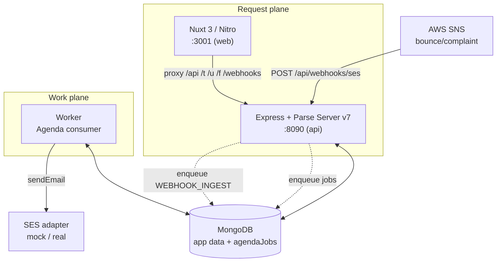
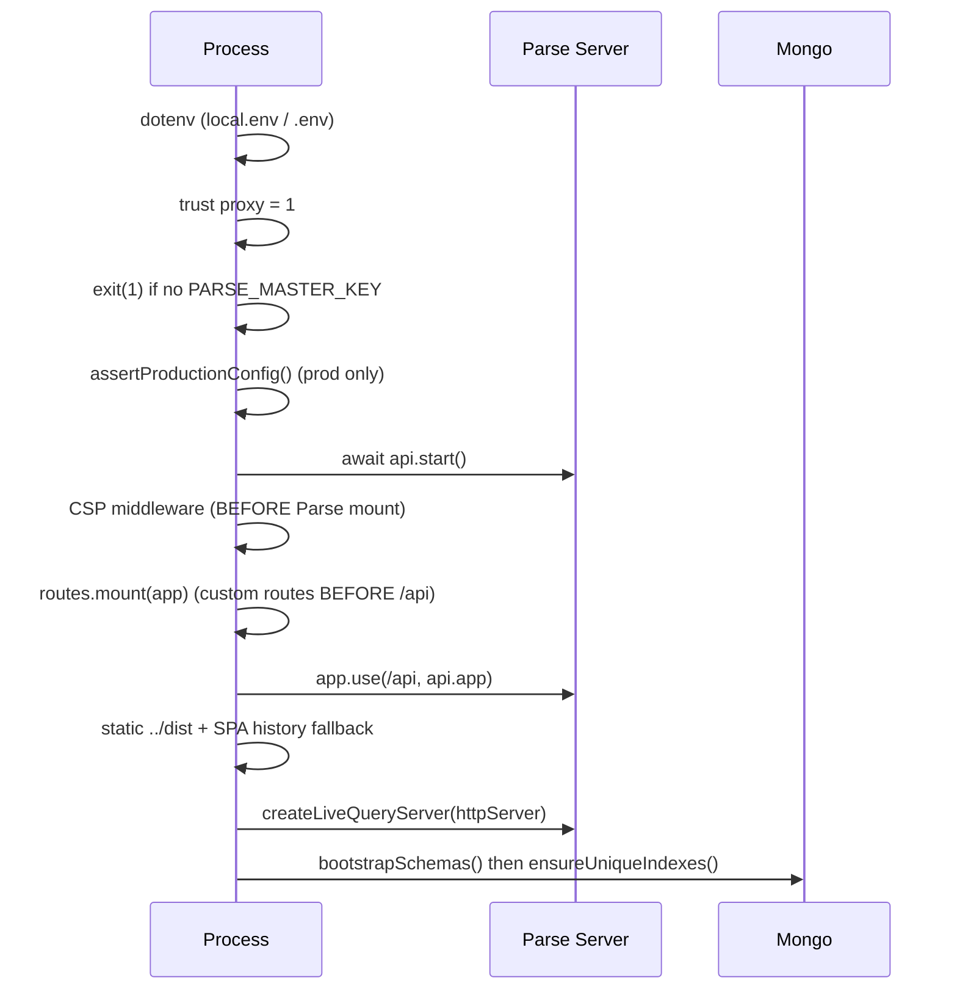
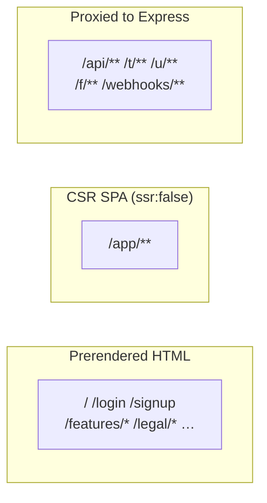
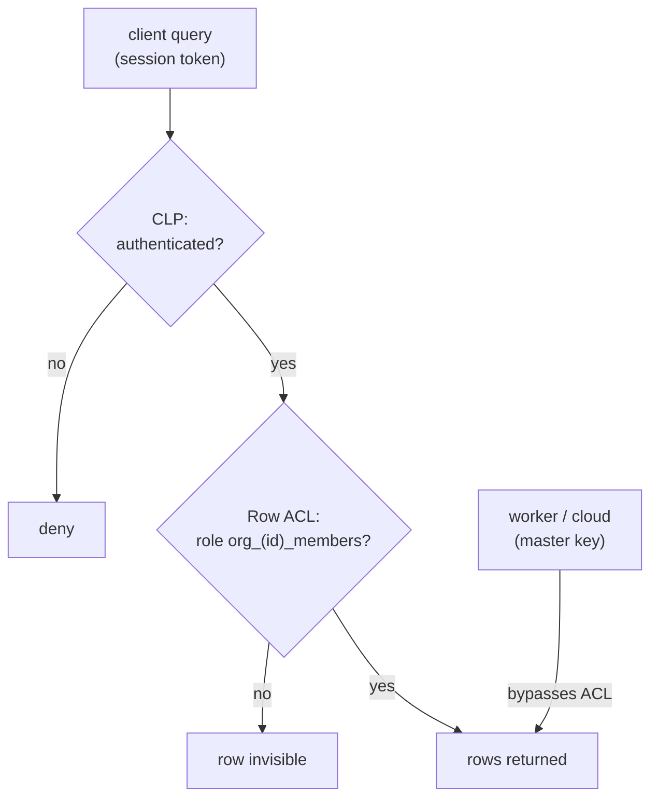
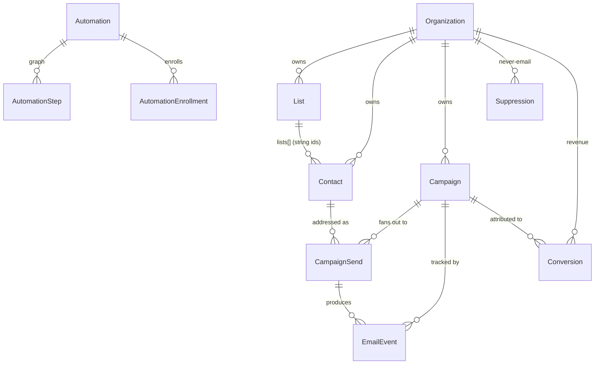
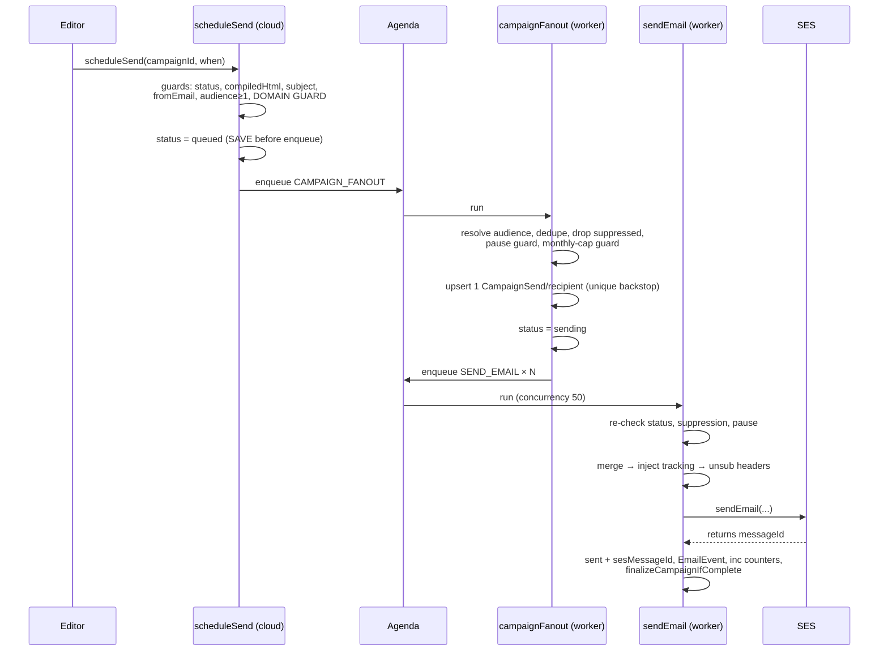
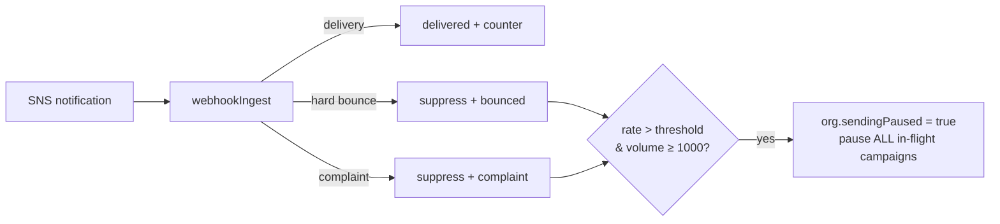

# Architecture

High-fidelity system design for Gorilla, verified against `main` (2026-06-01). Each
component lists its **stack**, **responsibility**, **key files**, and the **decision
+ tradeoff** behind it. Diagrams are inline (mermaid).

---

## 1. System overview

Gorilla is a **two-plane** system joined by a queue:

- **Request plane** — a Nuxt/Nitro frontend and an Express+Parse API. Synchronous,
  user-facing. Renders pages, serves the REST/cloud API, accepts tracking hits and
  webhooks.
- **Work plane** — a single long-running worker consuming a MongoDB-backed Agenda
  queue. Asynchronous. Owns everything that fans out or takes time: campaign
  fanout, per-recipient sends, webhook ingestion, CSV imports, automation ticks,
  conversion attribution, and ops maintenance.

MongoDB is the one shared dependency — it backs both Parse (application data) and
Agenda (the `agendaJobs` collection). There is **no Redis, no separate API tier, no
ORM**: app code talks to Parse directly.

**Decision — Parse-direct data layer (no ORM/API layer).** Components and cloud
functions use `Parse.Query` / `Parse.Object` / `Parse.Cloud.run` directly.
**Tradeoff:** maximum velocity and one fewer abstraction to maintain, at the cost of
business logic living close to the data shape and Parse's conventions leaking into
callers.

**Decision — Agenda over Redis/BullMQ.** The queue rides on the Mongo we already
run, coordinating job ownership via atomic `findAndModify` locks on `agendaJobs`.
**Tradeoff:** one fewer piece of infrastructure to operate; we give up Redis-grade
throughput and some BullMQ ergonomics (which we don't need at this scale).

---

## 2. Process & deployment topology

`npm run dev` starts **three** processes via `concurrently`:

| Process | Command | Port | Role |
|---|---|---|---|
| Web | `nuxt dev` | 3001¹ | Frontend dev server; in prod serves prerendered marketing + the SPA shell + proxies |
| API | `node ./server/index.js` | 8090¹ | Express + Parse Server REST `/api`, custom routes, LiveQuery host, **enqueues** Agenda jobs (never calls `agenda.start()`) |
| Worker | `node ./server/worker/index.js` | — | The only process that `agenda.start()`s and consumes jobs |

¹ Default ports are **3000 / 8080**; this machine runs them on **3001 / 8090**
(`PARSE_PORT=8090` in `server/local.env`) because a sibling project squats
3000/8080. The Nitro `/api` proxy target reads `PARSE_PORT`, so the override is
config-only.

Production: `npm run start` runs `gorilla` (API) and `gorilla-worker` under pm2.

### API startup sequence (`server/index.js`) — order is load-bearing

Why the order matters:
- **CSP middleware before the Parse mount** — Parse streams its response body
  first; a later `res.setHeader` would throw `ERR_HTTP_HEADERS_SENT`.
- **Custom routes before `/api`** — so `/api/webhooks/ses`, `/t/*`, `/u/*`, `/f/*`,
  `/health` win over Parse's class router.
- **`bootstrapSchemas` then `ensureUniqueIndexes`** runs after `listen`, with the
  master key, wrapped in try/catch (a schema/index hiccup logs and continues — it
  never crashes boot). See [§6](#6-data-model).
- **`trust proxy`** — so Parse `accountLockout` doesn't lock `127.0.0.1` for every
  user behind a reverse proxy.

The worker boot (`server/worker/index.js`) is simpler: `assertProductionConfig()` →
`initParseClient()` (master-key Node SDK) → `getAgenda()` → register all six job
handlers → `agenda.start()`, with SIGINT/SIGTERM draining via `agenda.stop()`.

---

## 3. Request routing & the marketing/app boundary

The single most important frontend rule:

> **Marketing pages live at top-level paths and are prerendered to static HTML.
> The authed app lives under `/app/*` and is client-side rendered (`ssr: false`).**

This is encoded in `nuxt.config.ts`:
- `routeRules`: `"/app": { ssr:false }`, `"/app/**": { ssr:false }`, plus proxy
  rules for `/api/**`, `/t/**`, `/u/**`, `/f/**`, `/webhooks/**` → the Express
  origin (`PARSE_PORT||8080`).
- `nitro.prerender.routes`: an explicit list of marketing routes baked to HTML at
  build (`/`, `/login`, `/signup`, `/pricing`, `/features/*`, `/docs*`, `/legal/*`,
  `/security`, company pages…).

**Decision — CSR for `/app/*`.** The Parse session token lives in `localStorage`,
which doesn't exist server-side; authed pages need the session readable on first
paint, so they boot in the browser. **Tradeoff:** no SSR/SEO for the app (fine — it's
behind auth and `noindex`), and a brief client-side auth-hydration gate before the
first guarded navigation resolves.

**Why the `/t`, `/u`, `/f`, `/webhooks` proxies exist:** links embedded in *sent
email* (open pixel, click redirects, unsubscribe) and *hosted signup forms* must
resolve through the same public origin as the app, but are served by Express, not
Nuxt. The proxies stitch them onto one origin.

> ⚠️ **Known gap:** `/pricing` is in the prerender list but `pages/pricing.vue`
> doesn't exist on `main`, so `/pricing` 404s (and `npm run generate` will choke on
> it). Either add the page or remove it from the prerender list. See
> [Known gaps](#known-gaps).

---

## 4. Backend stack & cloud-code organization

- **Express + Parse Server v7** (CommonJS), **MongoDB**, **Agenda v5**.
- **Module-system boundary:** the repo root is ESM (`"type":"module"` — Nuxt,
  plugins, stores). `server/package.json` overrides to `"type":"commonjs"`, so all
  `server/*.js` uses `require()`/`__dirname`. Keep this boundary intact.
- **AWS SDK** `@aws-sdk/client-sesv2` (lazy-required only in real mode); **busboy**
  (multipart) + **csv-parser** for imports; **mjml** to compile email blocks.

### The tenancy spine loads first

`server/cloud/main.js` requires `./organizations` then `./tenantHooks` **before** any
feature module, so the `_User` beforeSave and the per-tenant stamping hooks are
registered before any feature's beforeSave extension.

### One beforeSave per class — the `registerBeforeSave` registry

Parse allows exactly **one** `beforeSave` per class, and the tenancy stamp owns it. A
feature that needs its own beforeSave (e.g. `campaigns.js` compiling
`body.blocks → MJML → compiledHtml`) calls **`registerBeforeSave(className, fn)`**
(`tenantHooks.js`); the registry runs feature hooks *after* the tenant stamp, in
registration order, on insert + update. Calling `Parse.Cloud.beforeSave` directly
would clobber the tenancy stamp — so feature code never does.

### Worker job pattern

Every job file exports both `register(agenda)` **and** a pure `handle(data, deps)`.
Tests drive `handle` directly with injected stubs (no live Agenda/Mongo). Enqueue
helpers are lazy-`require`d so test paths never open a Mongo connection.

---

## 5. Multi-tenancy model

One account = one **`Organization`**. Signup (`signUpWithOrg` in
`server/cloud/organizations.js`) atomically-ish creates `_User` + `Organization` + a
`_Role` named **`org_<orgId>_members`**, adds the user to the role, and stamps the
user with an `organization` pointer + `role:"owner"` (best-effort cleanup on partial
failure — Mongo has no multi-doc transaction here).

**Three isolation layers** (`server/cloud/lib/tenancy.js`,
`server/cloud/lib/bootstrapSchemas.js`):

1. **CLP** (`authOnlyCLP`) — every per-tenant class requires authentication for all
   ops; no public access.
2. **Row-level ACL** (`orgRoleACL`) — read+write limited to `role:org_<id>_members`.
   **This is the security boundary** — the filter runs inside Parse/Mongo, so a query
   under the wrong session simply returns zero rows.
3. **`organization` pointer** — convenience for explicit filtering + index locality;
   **not** a security mechanism.

**Per-tenant `beforeSave` stamping** (`makeBeforeSave`): on insert, it resolves the
caller's org (from `request.user` via `getUserOrg`, or an already-set `organization`
for worker/master writes) and stamps `organization` + `orgRoleACL`; on update it
leaves org/ACL alone and **rejects** moving a row to another org. This is why feature
code writes zero tenancy boilerplate — a logged-in `new Parse.Object("Campaign").save()`
gets org + ACL automatically.

**The master key bypasses ACL** — workers and cloud functions use it deliberately
(fanout, webhook ingest, suppression). Client code never sees it.

> **Worker gotcha:** a master-key save with *no* `request.user` hits a degenerate
> pass-through that skips stamping, so the worker must set `organization` explicitly
> (e.g. `importCsv.js`) — otherwise rows save but org-scoped/ACL-enforced reads can't
> see them.

**Per-tenant classes (20):** `List, Contact, Segment, Campaign, Template,
CampaignSend, EmailEvent, Suppression, CustomField, SenderIdentity, SendingDomain,
SuppressionAuditLog, ImportJob, Form, FormSubmission, Automation, AutomationStep,
AutomationEnrollment, Conversion, StoreConnection`.
**Not per-tenant:** `Organization` (bespoke ACL), `_User`, `ApiKey` (self-stamps),
and `MockSentMessage` + `WorkerHeartbeat` (master-key-only CLP).

---

## 6. Data model

All classes are declared in `server/cloud/lib/bootstrapSchemas.js` (idempotent;
runs at boot). **Money is stored as integer minor units** (e.g. cents) everywhere.

### The "unique index that wasn't" — and the fix

Parse's `Schema.addIndex(name, spec)` only ever creates a **non-unique** Mongo index
(the JS schema API has no unique flag). So every index `bootstrapSchemas` named
`*_unique` was, in fact, **not unique** — the dedupe backstops (duplicate send,
duplicate contact, suppression, conversion idempotency) were illusory.

`server/cloud/lib/uniqueIndexes.js` fixes this: after bootstrap, it connects via the
**raw Mongo driver** and creates real unique constraints, **reusing the same index
names** (so Parse won't recreate a non-unique twin). It migrates a stale non-unique
index by dropping and recreating it unique; on pre-existing duplicate data (`E11000`)
it **logs loudly and continues** (never crashes boot, no regression). Pointer fields
map to Mongo `_p_<field>`; `sesMessageId` is **sparse-unique**; the conversion key is
a **partial** unique index (`{orderId:{$exists:true}}`).

**Identity** — `Organization` (slug `org_slug_unique`; `monthlySendCap`/
`monthlySendCount`; CAN-SPAM `address`; abuse counters
`complaintCount`/`hardBounceCount`/`sendingPaused*`), `_User`
(org pointer + role), `SenderIdentity`.

**Audience** — `Contact` (**`lists` is an Array of List-id strings**, status,
`customFields` object, consent, LTV rollup `totalRevenue`/`orderCount`/`lastOrderAt`;
**unique `(organization,email)`**), `List`, `CustomField` (per-org field registry;
unique `(organization,key)`), `Segment` (rule-tree `rules` object → Parse query).

**Campaigns** — `Template` (`body={version,blocks}`, system vs org), `Campaign`
(**`body` object is the source of truth**, `compiledHtml` is the blocks→MJML→HTML
output, `audienceId` is a List-id string, optional `segmentId`, denormalized
engagement + revenue counters).

**Sending/tracking** — `CampaignSend` (per-recipient row; `mergeFields` snapshot at
queue time; **unique `(campaign,contact)`** = the duplicate-send backstop;
**sparse-unique** `sesMessageId`), `EmailEvent` (open/click/bounce/etc.; `timestamp`
is event-occurred, not write time).

**Suppression/domains** — `Suppression` (unique `(organization,email)`),
`SuppressionAuditLog`, `SendingDomain` (DKIM/SPF/DMARC records + `verified` flag).

**Imports/forms** — `ImportJob` (filePath, mapping, consent, counters),
`Form` (fields, `targetListId`, `doubleOptIn`), `FormSubmission`.

**Automations** — `Automation` (trigger + stats), `AutomationStep`
(send_email/wait/branch/exit graph), `AutomationEnrollment` (`nextRunAt`,
`claimedAt`, `context`).

**Revenue/API/stores** — `Conversion` (sourceType, revenue in minor units,
attribution model; partial-unique on orderId), `ApiKey` (`keyPrefix` + **HMAC
`keyHash` only — raw never stored**), `StoreConnection` (per-store `webhookSecret`).

**Ops** — `MockSentMessage` (mock-SES outbox), `WorkerHeartbeat` (liveness).

---

## 7. The send pipeline

The core product flow, three stages across the request plane and work plane.

**Stage 1 — `scheduleSend`** (`server/cloud/sending.js`). Loads the campaign as the
caller (cross-org → `OBJECT_NOT_FOUND`), runs content/identity/audience guards, then
the **unverified-domain guard** (`assertSendableFromDomain`): the shared
`send.gorilla.email` is always allowed; any *custom* from-domain requires a
`verified:true SendingDomain` for the org, else `OPERATION_FORBIDDEN`. It **saves
the status flip before enqueuing** — the DB row is the source of truth; the queue is
best-effort and re-drivable. (`sendTestEmail` is a separate preview path: ≤5
recipients, direct adapter send, no CampaignSend/tracking/suppression.)

**Stage 2 — `CAMPAIGN_FANOUT`** (`server/worker/jobs/campaignFanout.js`, concurrency
2). Re-fetches the campaign (bails unless `queued`), resolves the audience (a
`Segment` if `segmentId`, else a paged List query), dedupes by lowercased email,
drops suppressed addresses, then two safety guards: if `org.sendingPaused` →
`paused`; if `used + recipients > monthlySendCap` → `failed` (fail cleanly, never
half-send). It upserts one `CampaignSend` per recipient — idempotent via a cheap
pre-check **and** the unique `(campaign,contact)` index backstop — snapshots
`mergeFields`, flips the campaign to `sending`, and enqueues one `SEND_EMAIL` per new
row.

**Stage 3 — `SEND_EMAIL`** (`server/worker/jobs/sendEmail.js`, concurrency 50). Per
recipient: re-check `queued`; re-check suppression (→ `suppressed`); if the campaign
was paused after queueing, leave the row `queued` so resume can re-send. Then render
(`resolveMergeFields` → `injectTracking` → `injectUnsubscribe` → `listUnsubHeaders`),
send via the adapter, and on success store `sesMessageId` + `sent`, write an
`accepted` EmailEvent, bump `sentCount`, **atomically `$inc` `org.monthlySendCount`**,
and call `finalizeCampaignIfComplete`. On failure: `failed` + reason, finalize, and
**re-throw** so Agenda retries.

`finalizeCampaignIfComplete` (`server/lib/campaignCounters.js`) flips
`sending → sent` once no `CampaignSend` rows remain `queued`; it's idempotent and
only the actual flipping call returns true.

### The SES adapter

`server/lib/ses/index.js` selects by `AWS_SES_MODE` (default `mock`), memoizing the
choice. Contract: `sendEmail({from,to,replyTo,subject,html,headers,campaignSend}) → {messageId}`,
throws on hard failure.

- `mock.js` — returns `mock-<hex>` and persists a `MockSentMessage` (master key, no
  network). The hermetic default for dev/test.
- `real.js` — lazy-loads the SESv2 SDK, builds a `SendEmailCommand` (Simple content,
  optional `SES_CONFIGURATION_SET`, custom headers).

**Decision — mock-SES-first.** The entire pipeline runs end-to-end with no AWS
account; the swap to real is a single env var. **Tradeoff:** the real path is
unit-tested but, until a live AWS run, unproven against real DKIM/DMARC and SNS
payloads (this is the remaining external launch blocker).

---

## 8. Tracking & deliverability

### HMAC tracking tokens (`server/lib/trackingTokens.js`)

`token = base64url(JSON payload) + "." + first22(base64url(HMAC-SHA256(secret, body)))`.
Tokens **never expire**. The payload is **not secret** (it carries a `sendId`); the
HMAC only prevents forgery/tampering, verified with a length-guarded constant-time
compare. One secret signs every token kind: open `{t:"o"}`, click `{t:"c",url,linkId}`,
unsubscribe `{t:"u"}`, form-confirm `{t:"fc"}`, conversion pixel `{t:"p"}`. Secret
source: `TRACKING_SECRET` → `TRACKING_TOKEN_SECRET` → a loud dev default (the dev
default is **rejected at boot in production** — see [§10](#10-security-posture)).

### Tracking injection (`server/lib/renderEmail.js`, pure functions)

`resolveMergeFields` substitutes `{{key}}` / `{{custom.x}}` / `{{key|default}}`
(HTML-escaped; reserved link placeholders left intact). `injectTracking` rewrites
every `<a href>` through the click endpoint (skipping `mailto:`/`tel:`/`#`/`{{…}}`)
and appends a 1×1 open pixel before `</body>`. `injectUnsubscribe` swaps
`{{unsubscribeUrl}}`. `listUnsubHeaders` emits `List-Unsubscribe` +
`List-Unsubscribe-Post: List-Unsubscribe=One-Click` (RFC 8058).

### Tracking routes (`server/routes/tracking.js`)

| Route | Does |
|---|---|
| `GET /t/o/:token` | 1×1 GIF (no-store) + fire-and-forget open event (first-open only bumps `openCount`; IP anonymized to /24) |
| `GET /t/c/:token` | 302 to the payload URL + click event (first-click only bumps `clickCount`) |
| `GET /t/p/:token` | conversion pixel → enqueues `ingest-conversion` (sourceType `pixel`) |
| `GET /u/:token` | unsubscribe confirm page |
| `POST /u/:token` | records unsub (handles both the confirm form **and** RFC 8058 one-click; idempotent) → `addSuppression(reason:"unsubscribe")` |

### SNS ingestion & abuse auto-pause

`POST /api/webhooks/ses` (`server/routes/webhooks.js`) parses the SNS envelope.
`SubscriptionConfirmation` → verify, then GET the SubscribeURL. `Notification` →
`isAuthentic`, then enqueue `WEBHOOK_INGEST` and **always fast-ack 200** (so SNS
never retry-storms us). In real mode, `isAuthentic` does full RSA signature
verification against the cert at `SigningCertURL`, requiring the host to match
`sns.<region>.amazonaws.com` exactly.

`WEBHOOK_INGEST` (`server/worker/jobs/webhookIngest.js`, concurrency 20) finds the
`CampaignSend` by `sesMessageId` and branches: **Delivery** → `delivered`;
**permanent Bounce** → suppress (`hard_bounce`), `bounced`, bump org bounce counter;
**transient Bounce** → soft (`Contact.softBounceCount++`, promote at threshold 5);
**Complaint** → suppress (irrevocable), bump org complaint counter.

**Org auto-pause** is the **shared-domain reputation safety net**: thresholds are
complaint-rate 0.1% and hard-bounce-rate 5% (min volume 1000, against
`monthlySendCount`). When crossed, the org is paused and every queued/sending/
scheduled campaign halts.

**Decision — in-house tracking + ingestion instead of an ESP.** We own the HMAC
links, the open/click/unsub model, and the bounce/complaint pipeline. **Tradeoff:**
full control and no per-event ESP fees, at the cost of building (and operating) SNS
ingestion, suppression, and abuse controls ourselves — and the shared sending domain
means **one bad tenant can poison the pool**, which is exactly why auto-pause exists.

---

## 9. Subsystems

**CSV import.** `POST /api/imports/upload` (`server/routes/imports.js`) streams via
busboy to a **server-minted** `/tmp/import-<128-bit-hex>.csv` (~100 MB cap), sniffs a
preview, and is session-gated by a master-key `_Session` lookup (not
`User.become`, which isn't memory-safe server-side). The **safe-path guard**
(`server/lib/importPaths.js`) — `assertSafeImportPath` — is enforced at the upload,
the `startContactImport` cloud fn, and the worker, so a client can never point the
reader at an arbitrary file (this closed a master-key-exfiltration hole). The worker
(`importCsv.js`) maps by column index, validates/dedupes/suppression-skips, batches
counter `$inc`s, and reconciles `List.contactCount`.

**Signup forms.** Public, no-auth, server-rendered (`server/routes/forms.js`):
`GET/POST /f/:formId`, `GET /f/confirm/:token`, `GET /f/:formId/embed.js`. Spam
controls: a `website` honeypot + a per-IP in-memory rate limit. Submit → upsert
Contact (consent stamped) → `FormSubmission` → double-opt-in (`pending` + confirm
email) or immediate `subscribed`. **Org is resolved from the Form row** (master key),
never the session. Authed CRUD lives in `server/cloud/forms.js`.

**Automations / journeys.** `server/cloud/automations.js` (CRUD + linear step graph
+ recipes). `enrollByTrigger` is the entry, wired into `Contact.afterSave` for
`contact_added_to_list`. The runner (`automationTick.js`, `agenda.every("60s")`)
selects active, due (`nextRunAt<=now`) enrollments, **claims each via `claimedAt`** (a
5-min-TTL lease that prevents double-run), and walks one step per tick:
`send_email` / `wait` (armed-flag model) / `branch` / `exit`.

**Revenue attribution.** Two intakes — the API (`POST /api/v1/events/purchase`,
API-key Bearer auth) and ecommerce webhooks (`POST /webhooks/shopify|woocommerce`,
per-store HMAC over the raw body). Both enqueue `ingest-conversion`
(`server/worker/jobs/ingestConversion.js`), which is idempotent on
`(org,orderId,sourceType)`, runs last-touch attribution (`lib/attribution.js`:
recent click ≤7d → `last_click`; else open ≤1d → `last_open`; else `unattributed`),
writes a `Conversion`, and rolls up Campaign revenue + Contact LTV.

**API keys** (`server/lib/apiKeyAuth.js`). `gk_live_<32 url-safe bytes>`; we store
the `keyPrefix` + an HMAC-SHA256 hash. `authenticate` looks up by prefix and does a
**constant-time** hash compare (with a dummy compare when no row exists, for timing
uniformity). The raw key is shown exactly once, at creation.

**Domains** (`server/cloud/domains.js`, mock-DNS-first). `createSendingDomain`
issues deterministic DKIM/SPF/DMARC snippets; `verifyDomain` attempts a real
`dns.resolveTxt` and falls back to a mock pass when DNS isn't resolvable. The
`verified` flag is exactly what `scheduleSend`'s domain guard reads.

**Ops & health.** `opsTick.js` (`agenda.every("30s")`): (1) writes
`WorkerHeartbeat.beatAt` **through Agenda**, so a stalled queue stops the heartbeat —
proving end-to-end processing, not just a live process; (2) sweeps campaigns stranded
in `sending` (recovers via `finalizeCampaignIfComplete`, logs ones stuck >30 min,
never auto-fails). `server/routes/health.js`: `GET /health` (liveness, no deps) and
`GET /ready` (503 unless Mongo is reachable **and** the heartbeat is fresh within 90 s).

---

## 10. Security posture

The recently-closed launch-blockers (all on `main`):

1. **CSV arbitrary-file-read** → random tmp paths + `assertSafeImportPath`
   re-validated at every boundary.
2. **Unverified-domain send guard** in `scheduleSend` (anti-spoof + DKIM/DMARC
   alignment).
3. **Real unique indexes** (`uniqueIndexes.js`) — the only thing making the
   duplicate-send/contact/suppression/conversion backstops real.
4. **Fail-hard production config** (`lib/env.js assertProductionConfig`, in **both**
   processes): in production, refuse to boot without `PARSE_MASTER_KEY`,
   `TRACKING_SECRET`, `PUBLIC_BASE_URL`, and (in real SES mode) AWS creds —
   eliminating forgeable tokens / localhost links.
5. **SNS signature verification** (real mode) with strict host matching.
6. **Per-store / per-key HMAC** with constant-time compares; `ApiKey` stores only a
   hash.

Plus the standing isolation guarantees from [§5](#5-multi-tenancy-model): CLP +
role-ACL on every per-tenant class, and no cloud function trusts a client-supplied
`organizationId`.

---

## 11. Cross-cutting

- **Module systems** — root ESM vs `server/` CJS; keep the boundary.
- **Design tokens** — `assets/css/tokens.css` is the single source of truth for
  color/type/space/radius/motion (loaded globally; a duplicate lives at
  `mocks/_pop/tokens.css`). Never hardcode token values.
- **Testing** — Vitest for cloud fns / worker jobs / SES adapter / components
  (in-memory Mongo per file for Parse; a service Mongo at 27017 for the Agenda
  enqueue path). Playwright for e2e. CI (`.github/workflows/ci.yml`) runs vitest on
  every push/PR.
- **LiveQuery** — the API hosts a LiveQuery server (`classNames:["Campaign"]`), but
  no client currently subscribes; all app data flows via request/response cloud
  functions today.

---

## Known gaps

Keep this list honest and current.

- **`/pricing` 404** — prerendered in `nuxt.config.ts` but `pages/pricing.vue` is
  absent on `main`; also breaks `npm run generate`.
- **`composables/shared/useApi.ts` missing** — imported by `useApiKeys.ts` and
  `useStores.ts`, so `/app/settings/api-keys` and `/app/settings/integrations` break
  when opened.
- **Real AWS SES unproven end-to-end** — only the mock path has run live; the live
  DKIM/DMARC + SNS round-trip is the remaining external launch blocker.
- **Open P1s** — per-tenant send-rate limiting, Agenda retry/backoff tuning, monthly
  send-count reset, a global (cross-tenant) reputation monitor, CAN-SPAM address
  enforcement at send time, GDPR account export/delete. See `LaunchP1Backlog.md`.
- **Stale "integration delta" comments** — several cloud files still claim their
  class self-stamps org/ACL; on `main` the tenancy spine registers all 20 classes, so
  that stamping is redundant-but-idempotent.
