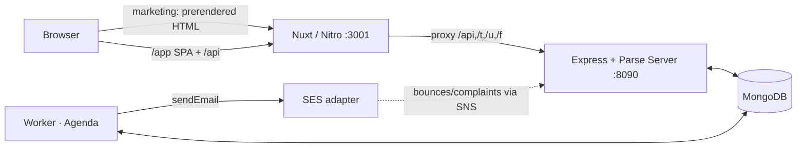

# Fe-Mail Gorilla — Documentation

Welcome to the living documentation for **Gorilla**, a self-hosted, Mailchimp-style
email-marketing platform. This folder (`/documentation`) is the **single source of
truth for product & engineering docs going forward** — drop a new `.md` here and it
shows up in the sidebar automatically.

> **Status:** authored 2026-06-01 against `main`. These docs describe what is
> actually built and merged, and call out the known sharp edges. They supersede the
> older root-level `Architecture.md` / `Sending.md` for day-to-day reference (those
> remain as historical design records).

## Read these first

| Doc | What's in it |
|---|---|
| **[Architecture](#/architecture)** | High-fidelity system design — processes, data model, the send pipeline, every subsystem, and the decisions/tradeoffs behind them. With diagrams. |
| **[Pages](#/pages)** | Page-by-page reference for the whole frontend — every route, its layout/middleware, where its data comes from, and the under-the-hood decisions. |

## What Gorilla is, in one paragraph

A hybrid app: **SEO-critical marketing pages are prerendered to static HTML**, and
the **authed product lives entirely under `/app/*` as a client-side SPA**. The
frontend is **Nuxt 3**; the backend is **Express + Parse Server v7** on MongoDB,
with a separate **Agenda-backed worker** that runs the email send pipeline. Email
goes out through a **pluggable SES adapter** (mock by default; real AWS SES via one
env var), with **in-house open/click/unsubscribe tracking** and **SNS webhook
ingestion** for bounces/complaints. Everything is **multi-tenant** — one
`Organization` per account, isolated by Parse role-ACLs.



## Running the docs site

```bash
npm run docs     # zero-dep static server → http://localhost:5051/
```

The server (`scripts/docs-server.cjs`) is a sibling of `npm run mocks`: it serves
this folder and exposes `/docs.json` (a manifest it builds by scanning `*.md`). The
browser viewer (`documentation/index.html`) renders Markdown with **marked**,
diagrams with **mermaid**, and code with **highlight.js** (all via CDN, so the
server stays dependency-free). Deep links work: `…/#/architecture#the-send-pipeline`.

## Conventions for new docs

- **One topic per file**, kebab-cased: `deliverability-runbook.md`, `api-reference.md`.
- The **first `# H1`** becomes the sidebar title. `##`/`###` headings populate the
  per-page table of contents automatically.
- Sidebar order: `index → architecture → pages`, then everything else alphabetically
  (tweak the `ORDER` array in `scripts/docs-server.cjs` to pin more).
- Use **```mermaid** fenced blocks for diagrams — they render inline.
- Keep them **honest**: document what's built, and flag stubs/known-gaps explicitly
  (there's a "Known gaps" section in the architecture doc — keep it current).

## Related (historical) design records

These predate this folder and capture original design rationale; cross-reference but
prefer the docs here when they disagree:
`Architecture.md`, `Sending.md`, `DECISIONS.md`, `RevenueAttribution.md`,
`Features.md`, `LaunchReadiness.md`, `LaunchP1Backlog.md`, `CLAUDE.md`.
